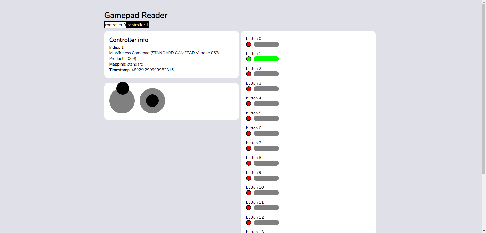

# Reading Controller inputs with the Gamepad API
With javascript, you can develop games that can run in anyone's web browser. Keyboard and Mouse inputs work fine but have you ever wanted to make your games playable with a controller? To make your game play just like a console game? With the controller api, you can do that.

## Excecution notes
Note that I haven't gotten this working in firefox yet unfortunately. It might need https to work.  
You will also need to have a controller connected to your browser.  
Page link: https://ehren-strifling.github.io/gamepad-api/

## Events
There are 2 events in the gamepad api: **'gamepadconnected'** and **'gamepaddisconnected'**.  
The gamepadconnected event is called whenever a gamepad is connected or, when a button is first pressed if the controller was connected before the page loaded.  
The gamepaddisconnected event is called whenever a gamepad is disconnected.
Gamepad events will have a **'gamepad'** property which whill be a Gamepad object.

## navigator.getGamepads
The navigator.getGamepads method will return an array of all connected gamepads. This is the only way to update the gamepads inputs reliably as events only trigger on connect and disconnect.

## The main loop
Since there is no event for when a button is pressed on the gamepad, we will have to use a loop on a timer instead. Fortunately, this is already how most games run.  
For this project's main loop, I will be using setTimout to run code 60 times every second.  

## The Gamepad object
The gamepad object has 3 important non-array properties and 2 array properties.  
index: Unique id given by the browser to this controller. No 2 controller will share the same index.  
id: String that has details like vendor information. Like userAgent but for controllers.  
timestamp: Last time that this controller was updated. This value only changes when a button or axis is updated.

The array properties are
buttons: An array of 'GamepadButton' objects. GamepadButtons objects have 2 values: pressed (whether the button is pressed or not), and value (analog value, usually 0 or 1 but some controllers have analog triggers and this is how you'd see them).  
axis: An array of numbers representing the axises (usually control sticks) pressed on the gamepad. Note that the x and y axis for each stick will be 2 seperate entries in the array.

## Guide to navigating the code
I would recommend you check out GamepadReader.tick() in the code since that's the only part that actually reads the controller's inputs.
GamepadReader.selectionChanged is the mess of a method that creates all the html.
I would not recommend copying my code that keeps track of the controllers. This was my first time using the controller api and my code was an absolute mess.

## Example
Here is what the page looks like with a nintendo switch pro controller connected with the "a" button pressed and the left joystick held upwards.
